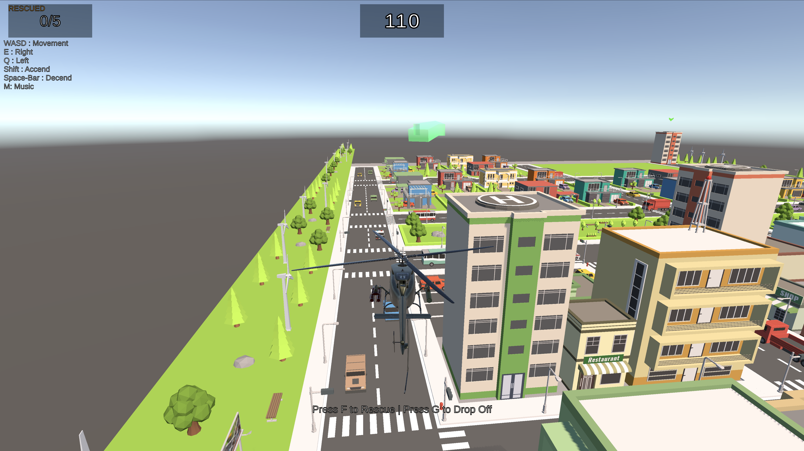
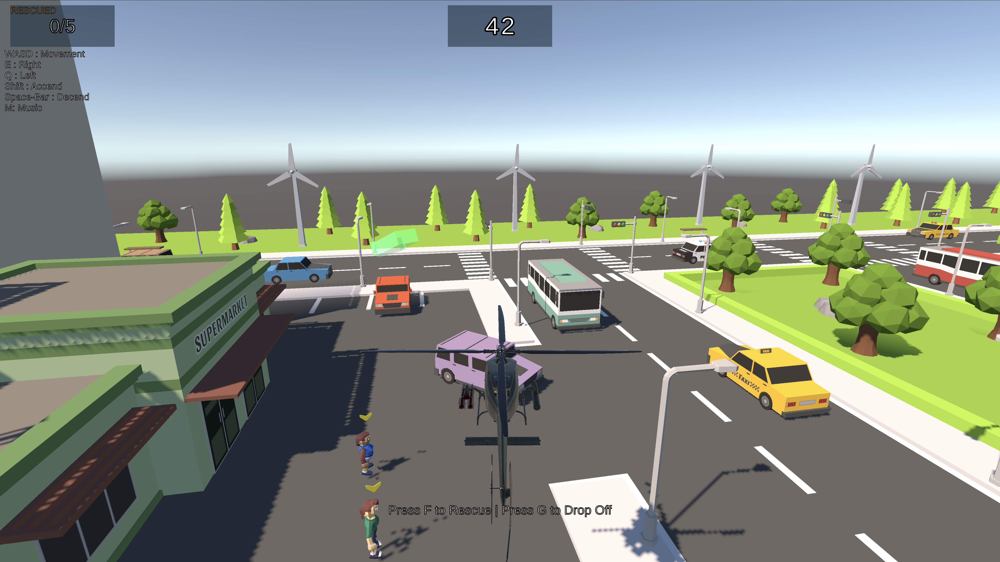

# SkyRescue 🚁

A Unity 3D helicopter rescue game set in a low-poly city. Pilot a helicopter to rescue people and drop them off at the hospital before time runs out.

## Gameplay

- Fly a helicopter across a low-poly city
- Pick up rescue survivors from the ground
- Drop them off at the hospital zone
- Avoid birds and manage fuel
- Beat the clock to complete all rescues

## Controls

| Key | Action |
|-----|--------|
| WASD | Movement |
| E | Ascend |
| Q | Descend |
| Shift | Speed Boost |
| Space Bar | Descend |
| M | Music Toggle |
| P | Pick Up / Rescue |
| B | Drop Off |

## Screenshots

## Built With

- Unity 3D
- C#

## Author

**Nikunj Shetye**
